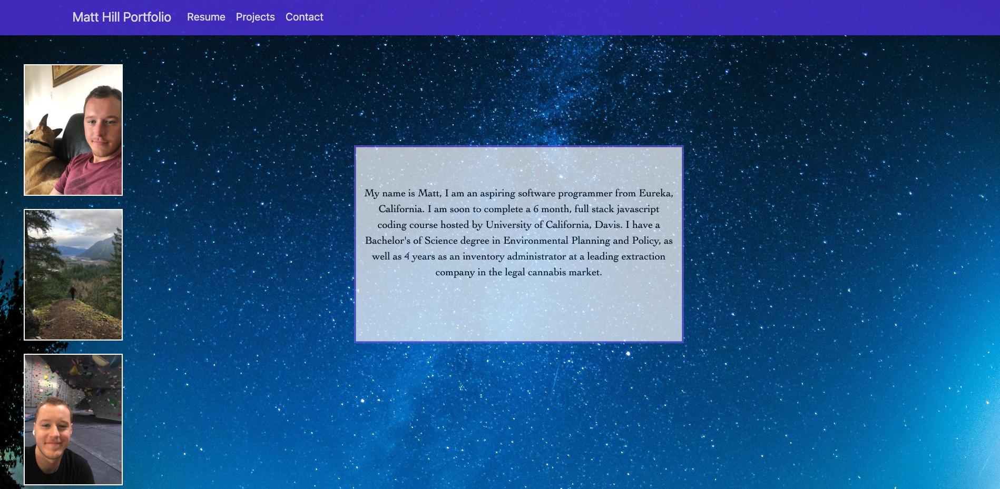
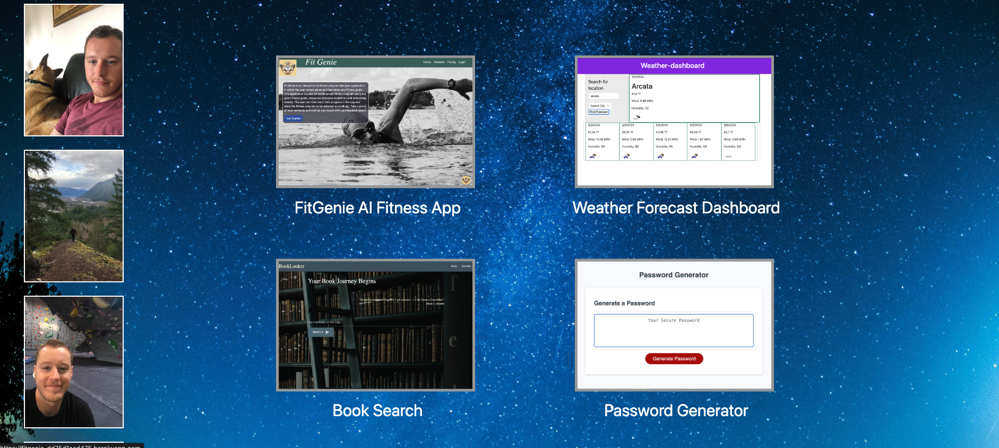

# Table of Contents
Matt Hill Portfolio
- [Project Name](#project-name)
- [Description](#description)
- [Installation](#installation)
- [Usage](#usage)
- [Features](#features)
- [Contributing](#contributing)
- [License](#license)
- [Tests](#tests)
- [Questions](#questions)
- [Screenshots](#screenshots)
## Project Name
${Matt Hill Portfolio}
## Description
My name is Matt Hill, this is a portfolio application to share the coding application projects I have created. It includes my self description, resume, and a gallery of my projects. This application was built using ReactJS, express and node. 
## Installation
<code>npm install</code>
<code>npm run dev</code>

## Live Application

https://spontaneous-longma-5c102c.netlify.app/

## License
[[Mit License](https://img.shields.io/badge/License-MIT-yellow.svg)](https://opensource.org/licenses/MIT)

## Questions
- Email: [hillmatt58@gmail.com]()
- GitHub: [crunchwrapdestroyer]()

## Screenshots

